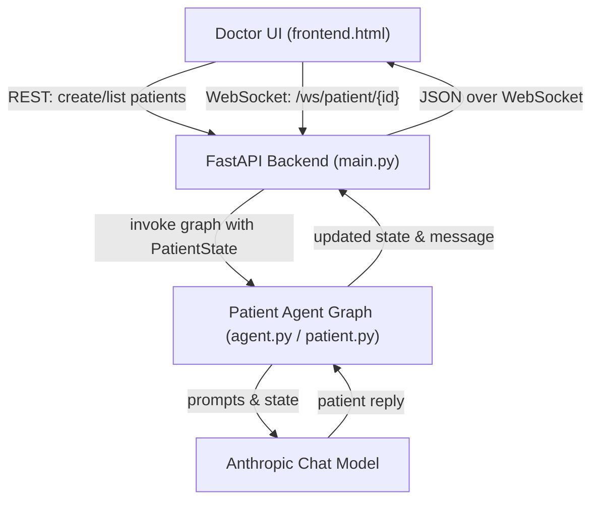

# PatBot

PatBot is a simulated patient chatbot that allows doctors to practice structured consultations in a web-based interface. Each virtual patient has a hidden diagnosis and symptom set; the doctor must elicit symptoms, propose treatments, and observe how the patient responds in realistic chat-style conversations.

## Deployed Application

- **Live app**: https://patbot-9dti.onrender.com/

## Architecture

PatBot is built as a small FastAPI backend serving a single-page doctor console, with real-time doctor–patient conversations handled over WebSockets and powered by a LangGraph-based patient agent running on Anthropic models.

- **Backend**: `FastAPI` application in `src/main.py` exposes:
  - REST endpoints for creating patients per doctor and listing active patients.
  - A WebSocket endpoint (`/ws/patient/{patient_id}`) that streams doctor messages to the patient agent and returns structured patient responses.
- **Agent graph**: The patient logic in `src/patient/agent.py` and `src/patient/patient.py` uses LangGraph with a `PatientState` to:
  - Classify the doctor’s intent (greeting, symptom inquiry, treatment prescription, general question).
  - Reveal symptoms incrementally when the doctor asks the right kinds of questions.
  - Evaluate whether a proposed treatment is accepted or rejected for the underlying condition.
  - Generate natural patient replies via Anthropic’s chat model.
- **Frontend**: A static HTML/JS interface (`src/static/frontend.html`) rendered at `/` that:
  - Creates new patients via REST, opens WebSocket connections per patient, and maintains a list of active consultations.
  - Displays chat history, conversation status, and a live list of revealed symptoms for the selected patient.

## Technologies Used

- **Backend framework**: FastAPI (ASGI) with CORS middleware.
- **Realtime transport**: WebSockets for doctor–patient chat sessions.
- **LLM & orchestration**:
  - `langchain-anthropic` for Anthropic Claude-based chat models.
  - `langgraph` for the stateful patient conversation graph.
- **Web server / runtime**: `uvicorn` as the ASGI server (Render deployment via `render.yaml`).
- **Environment / configuration**:
  - `python-dotenv` for loading environment variables.
  - `ANTHROPIC_API_KEY` configured as a private environment variable on Render.
- **Frontend**:
  - Static HTML/CSS/JavaScript UI (no frontend framework) with a doctor panel and multi-patient sidebar.
  - `marked` for rendering patient markdown responses safely in the chat view.
- **Testing & logging**:
  - Basic unit tests under `src/test` (for patient logic).
  - Structured logging of conversations to `src/conversations.log`.

## Key Design Choices

- **Stateful patient graph instead of ad-hoc prompts**: The patient is modeled as a LangGraph state machine (`PatientState`) with explicit nodes for intent classification, symptom revelation, treatment evaluation, and response generation. This keeps behavior predictable and easier to reason about than a single monolithic prompt.
- **Hidden diagnosis with controlled symptom leakage**: Each patient is initialized with a condition and a full list of symptoms (`CONDITION_SYMPTOMS`), but only reveals symptoms when the doctor asks appropriate questions. This enforces realistic diagnostic behavior and discourages “prompt guessing.”
- **Rule-based treatment acceptance**: Treatment recommendations are evaluated against curated `TREATMENT_OPTIONS` so that acceptance/rejection is deterministic and auditable, independent of model variability.
- **Multi-patient workflow for one doctor**: The frontend and connection manager (`ConnectionManager` in `main.py`) allow one doctor session to maintain multiple concurrent patient chats, mirroring a panel of active cases.
- **Minimal, framework-free frontend**: A single static HTML page with custom styling provides a focused “doctor console” without introducing a complex frontend build pipeline.

## Chatbot Functionality

- **Simulated patient behavior**: The chatbot always plays the role of the patient; it never reveals its underlying condition explicitly but responds as a realistic human patient would in text chat.
- **Conversation stages**:
  - **Greeting**: Responds naturally to salutations and initial rapport-building from the doctor.
  - **Symptom inquiry**: Gradually surfaces symptoms when the doctor asks about how the patient feels or what they are experiencing.
  - **General questions**: Handles non-treatment, non-symptom questions in a concise, patient-like manner.
  - **Treatment prescription**: Reacts to treatment proposals, either accepting them (and ending the consultation) or politely rejecting and asking for alternatives.
- **Symptom tracking UI**: As symptoms are revealed by the agent, they are surfaced in the UI’s “Revealed Symptoms” panel so the doctor can track progress at a glance.
- **Conversation completion**: When a treatment is accepted, the backend emits a `conversation_complete` message, the UI marks the patient as completed, and further messages are disabled for that patient.